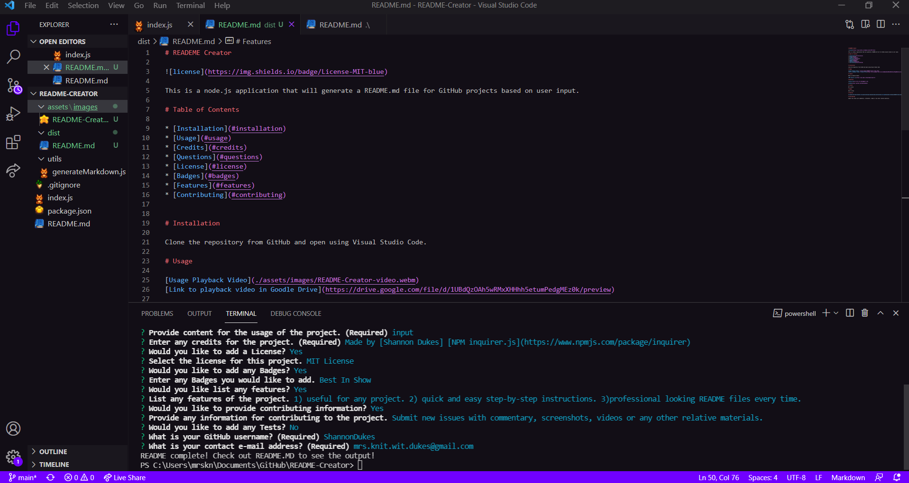

# README Creator
    

This is a node.js application that will generate a README.md file for GitHub projects based on user input.

# Table of Contents
    
* [Installation](#installation)
* [Usage](#usage)
* [Credits](#credits)
* [Questions](#questions)
* [License](#license)
* [Badges](#badges)
* [Features](#features)
* [Contributing](#contributing)

# Installation

Clone the repository from GitHub and open using Visual Studio Code.

# Usage 

[Usage Playback Video](../assets/images/README-Creator-video.webm)

[Link to playback video in Google Drive](https://drive.google.com/drive/u/0/folders/1BFyOYVbmI6g4ioolz2Lb27LfGqZ3lHMC) 

# Credits

Made by [Shannon Dukes] 

[NPM inquirer.js](https://www.npmjs.com/package/inquirer)

# Questions

[Contact Me](mrs.knit.wit.dukes@gmail.com)

[GitHub](https://github.com/ShannonDukes)

[ScreenCastify Folder on Google Drive](https://drive.google.com/drive/folders/1BFyOYVbmI6g4ioolz2Lb27LfGqZ3lHMC?usp=sharing)

# License
    
MIT License
    
# Badges
    
Best In Show
    
# Features
    
1) useful for any project. 2) quick and easy step-by-step instructions. 3) professional looking README files every time.
    
# Contributing
    
Submit new issues with commentary, screenshots, videos or any other relative materials.
    

